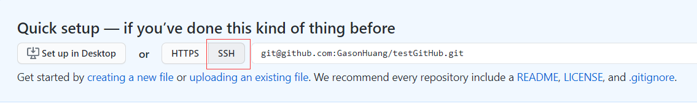

## 创建本地版本库

 1. 首先创建一个文件夹Repository

 2. 再新建一个文件夹Repo1

 3. 在Repo1创建本地仓库(3种方式)

     1. 右键选择"Git GUI Here"，再点击"Create New Repository"，再选择仓库路径。（如果要删除，直接删除.git隐藏文件夹即可）

     2. 右键选择"Git Bash Here"，输入'git init'

     3. 通过TortoiseGit创建，右键选择"Git在这里创建版本库"，不要勾选下方制作纯版本库。

        

​				

## 向本地仓库中添加文件

备注：.git的目录就是``本地版本库``，包含.git的目录就是``工作目录``

1. 右键新建文件
2. 右键文件->TortoiseGit->添加，添加完成后，文件图标有个"+"（表示已经加到暂存区，还未到本地版本库）
3. 在次右键文件，选择"Git提交"，此时将文件保存至版本库中

#### 查看本地仓库内容

* 右键"TortoiseGit"->版本库浏览器

#### 查看历史版本

* 右键文件->"TortoiseGit"->显示日志

#### 工作区和暂存区

## 删除本地仓库中的文件

#### 误删还原/修改后还原（未提交本地仓库）

* 右键"TortoiseGit"->"还原"

#### 删除本地仓库的文件

* 删除文件，右键提交
* 右键"TortoiseGit"->删除保留本地副本

## 将Java工程添加到本地版本库

1. 右键Java项目（项目要放到工作区内），添加到暂存区
2. 对于Java项目下不需要上传的文件，通过右键"TortoiseGit"->删除并添加到忽略列表
3. 忽略后会生成一个.gitignore文件，里面是忽略的文件信息，需要加到暂存区
4. 提交Java项目

## 在GitHub上创建仓库

1. 在github上创建账号
2. 在github上创建一个远程仓库

#### 推送到远程仓库

#####  ssh协议

什么是ssh?

SSH为Secure Shell（安全外壳协议）的缩写，由IETF的网络小组（Network Working Group）所指定。SSH是目前较可靠，转为远程登录会话和其他网络服务提供安全性的协议，利用SSH协议可以有效防止远程管理过程中的信息泄露问题。

基于密钥的安全验证

使用ssh协议通信时，推荐使用基于密钥的验证方式。你必须为自己创建一堆密钥，并把公钥放在需要访问的服务器上。如果你要连接到SSH服务器上，客户端软件就会向服务器发出请求，请求用你的密钥进行安全验证。服务器收到请求之后，现在该服务器上你的主目录下寻找你的公钥，然后它和你发送过来的公钥进行比较。如果两个密钥一致，服务器就用公钥加密“质询”（challenge）并把它发送给客户端软件。客户端软件收到“质询”之后就可以用你的私钥解密再把它发送给服务器。

#####  使用SSH方式

1. 生成密钥对

   右键"Git Bash Here "，输入"ssh-keygen -t rsa"，然后输入密钥对保存路径（或直接使用默认路径），其它的可以直接回车。

   

   

2. 使用文本编辑器打开公钥id_rsa.pub，复制内容，然后打开github的setting

   

   

   

3. 把本地仓库推送到远程

   1. 方式一：使用命令，右键"Git Bash Here "，输入下方命令

      

   2. 方式二：使用TortoiseGit，右键"Git同步"->"管理"

      

      需要确认是否已经使用了SSH

      

   3. 点击推送

      

      

      

#####  使用HTTPS方式

#### 克隆远程仓库到本地

##### 使用SSH方式

* 选择SSH方式，复制SSH路径

* 方式一：命令行方式，先在需要克隆的路径右键打开"Git Bash Here"

  

* 方式二：TortoiseGit方式，右键选择"Git克隆"

##### 使用HTTPS方式

## 推送修改的文件及冲突解决（15开始未看）